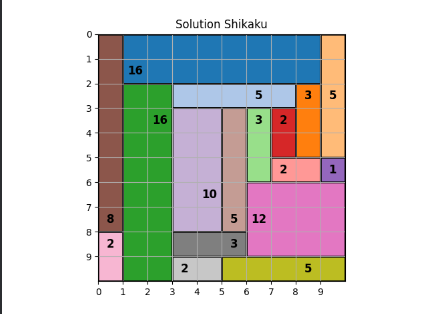

# 🧩 Shikaku Solver avec Recuit Simulé

## 📌 Présentation
Ce projet implémente un **solveur de grilles Shikaku** en utilisant l’algorithme du **recuit simulé** (*Simulated Annealing*).  

Le Shikaku est un puzzle japonais où l’objectif est de couvrir toute une grille avec des rectangles répondant aux règles suivantes :
1. Chaque rectangle contient exactement un nombre.
2. La surface du rectangle doit être égale à ce nombre.
3. Les rectangles ne doivent pas se chevaucher.
4. La grille entière doit être couverte.

Exemple :  
Une grille **5x5** avec ses nombres peut être découpée en rectangles de surfaces respectives.

---

## ⚙️ Fonctionnalités
- Génération **aléatoire de solutions initiales** valides.
- Définition d’une **fonction de fitness** évaluant la qualité d’une grille :
  - pénalité si la surface d’un rectangle ne correspond pas à la valeur,
  - pénalité si des cellules ne sont pas couvertes ou sont couvertes plusieurs fois,
  - pénalité en cas de chevauchement.
- Implémentation d’un **recuit simulé** pour améliorer progressivement la solution.
- **Visualisation graphique** avec `matplotlib` pour afficher la solution finale.

## Exemple

